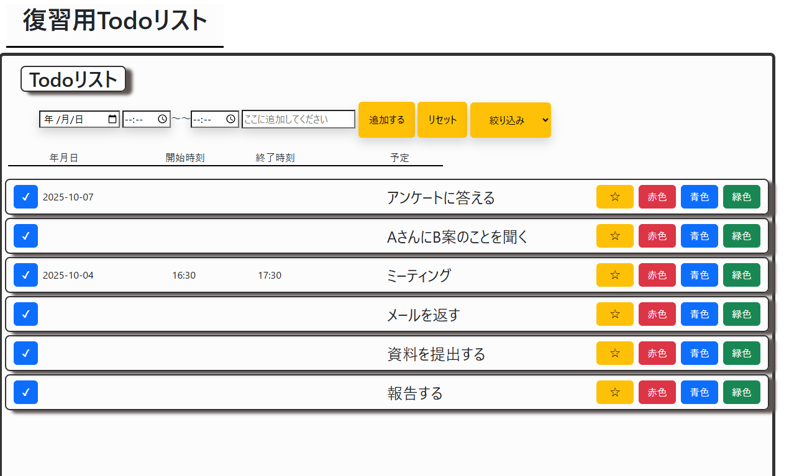
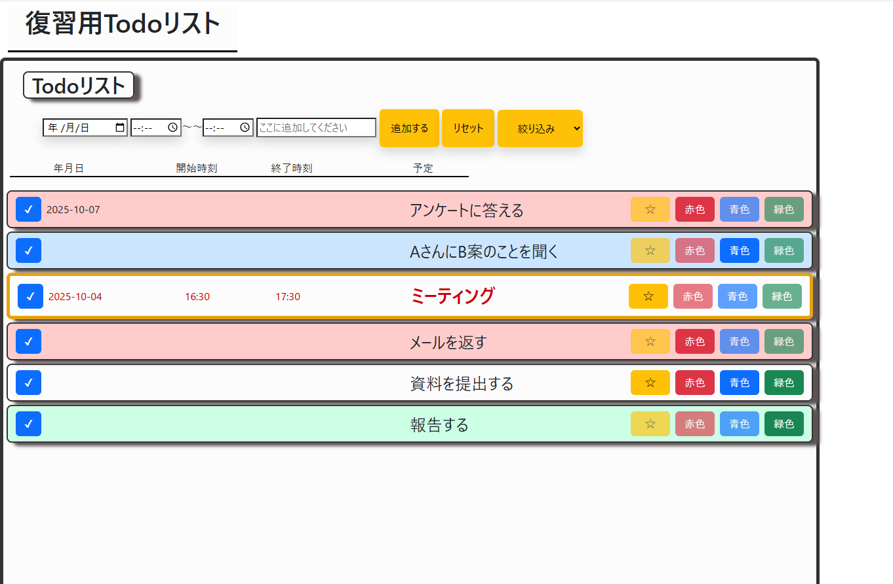

# 📝 Todo List App (初期版)

## 📌 概要
このアプリは **学習目的** で作成したシンプルな Todo リストです。  
HTML / CSS / JavaScript の基礎を活かし、ブラウザ上でタスクを管理できます。  
localStorage を利用してデータを保持するため、リロード後もタスクが残ります。  

---

## 🛠 使用技術
- HTML  
- CSS (Grid レイアウトを使用)  
- JavaScript (Vanilla JS)  
- localStorage  

---

## ✨ 主な機能
- ✅ タスクの追加  
- ❌ タスクの削除  
- ✔️ 完了済みタスクのチェック  
- 💾 localStorage による保存  
- 💡 ツールチップ表示（ボタンの動作を説明）  

---

## 🚀 デモ

 - 基本的な画面

 
 - タスクごとに色を付けることが出来ます

初期版リンク：(https://wataru-creato.github.io/Todo-app/)

初期からの修正点

- 色の意味がわからないとの指摘あり→色の意味を定義し，表示させた
- タスクを追加する場所が分かりづらい→ブロックを分けることで見やすくした

---

# Todoリスト開発で学んだこと

このリポジトリでは、Todoリストの開発を通じて得た学びをまとめています。  
HTML・CSS・JavaScriptの復習を兼ね，実装からGit/GitHubの運用、ドキュメント作成までを実際の業務を意識して作成することを心掛けました。

---

## 1. フロントエンド技術の学び

### レイアウト・デザイン
- `display: grid` を使ったタスク要素の配置調整
- タスク追加時の見た目調整、全体的なデザイン改善
- 横並び・縦並びの調整、表形式の見やすさ

### JavaScript
- DOM操作でタスク要素を動的に追加・編集
- `setAttribute` を使った属性の設定
- ツールチップの実装で操作内容をユーザーに視覚的に伝える
- ボタン操作の実装（追加・削除・リセット）
- 入力欄リセットや不具合修正など、ユーザー体験を意識した改善
- イベントの委譲による効率的なイベント管理
- localStorage を使ったタスクの保存・読み込み

### ファイル管理・参照
- CSS・JSの相対パス指定
- ファイル名の大文字・小文字やフォルダ構成の重要性

---

## 2. Git / GitHub の学び

### 基本操作
- `git add` → `git commit` → `git push` の流れ
- 1作業単位でのコミットの重要性
- コミットメッセージに絵文字を使い、変更内容を分かりやすくする

### リモート管理・GitHub Pages
- origin 設定や push のトラブル対応
- GitHub Pages で `index.html` をトップページとして公開
- ブランチや公開フォルダの選択

### 画像・ファイル管理
- 複数画像を `images/` フォルダに整理
- README.md への画像挿入方法（相対パス・外部URL）
- push して Pages に反映させる方法

---

## 3. ドキュメント作成・README の学び
- Markdown を使った文章構成
- スクリーンショットにキャプションや見出しをつけて整理
- 複数画像を順序・説明付きで挿入
- リポジトリ内のファイル構造に応じたパス指定の重要性

---

## 4. 開発・設計の学び
- UI/UX を意識した設計
  - ユーザーが何を操作したか分かるように表示
  - 見た目と機能のバランス
- デバッグ力の向上
  - ブラウザの Network タブで原因を特定
- 開発フローの意識
  - 小さな修正をこまめにコミットする
  - 振り返りとして README.md に学びをまとめる習慣

---

## まとめ
- **フロントエンド実装力**：HTML/CSS/JS + DOM操作 + localStorage  
- **Git/GitHub運用力**：コミット・push・Pages・ブランチ管理  
- **ドキュメント作成力**：README.md、画像、Markdown  
- **開発フロー・UI/UX意識**：操作性・デバッグ・整理された作業

Todoリスト開発を通じて、技術力だけでなく整理・記録・振り返りの習慣も身につけることができました。とくに修正した際には細かくコミットすることはデバックする際に役に立つことを学べました．
